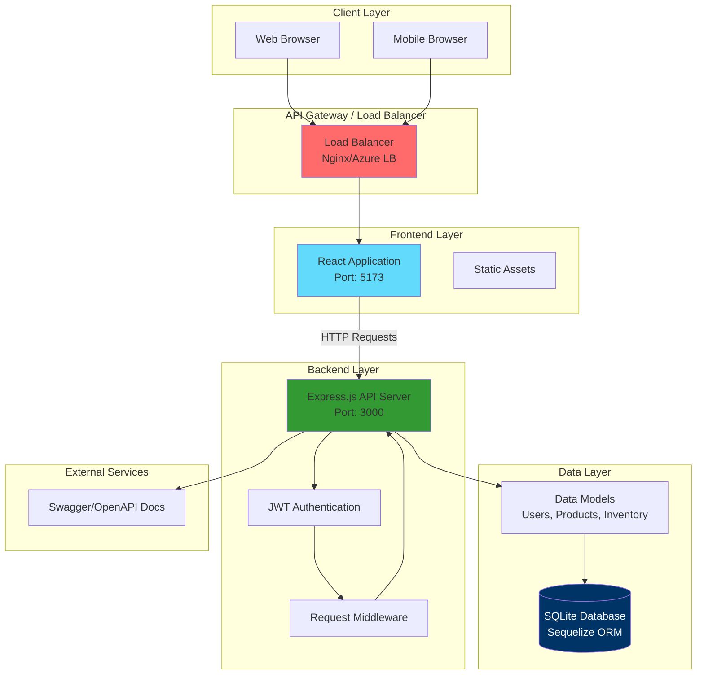

# Inventory Management System - Operations Manual

> A comprehensive full-stack web application for efficient inventory tracking, stock management, and automated low-stock alerts

## Table of Contents

- [Live Application](#live-application)
- [Architecture Overview](#architecture-overview)
- [Quick Start](#quick-start)
- [Setup Instructions](#setup-instructions)
- [Operations Guide](#operations-guide)
- [Usage](#usage)
- [Project Structure](#project-structure)
- [API Documentation](#api-documentation)
- [Development](#development)
- [Troubleshooting](#troubleshooting)
- [Future Enhancements](#future-enhancements)
- [Contributing](#contributing)
- [License](#license)

---

## Live Application

### 🌐 Production URL

**Live Application**: 🔗 [http://68.221.199.85/]
**Video Link**: https://drive.google.com/drive/folders/147xbcdABoEtIJ7aYhnu73b9Nm-GByxeh?usp=sharing


#### Finding Deployment URL

**If deployed via Terraform/Azure:**
```bash
cd terraform
terraform output app_url
# Example output: http://20.123.45.67
```

**If deployed manually:**
- Check your hosting provider's dashboard
- Use the domain/IP assigned to your application

**Local Development:**
- Frontend: http://localhost:5173
- Backend API: http://localhost:3000/api

### Application Access Points

Once you have the base URL, access the following:

| Service | URL Pattern | Description |
|---------|------------|-------------|
| **Frontend** | `{BASE_URL}` | Main web application interface |
| **Backend API** | `{BASE_URL}/api` | RESTful API endpoints |
| **API Docs** | `{BASE_URL}/api/docs` | Interactive Swagger documentation |
| **Health Check** | `{BASE_URL}/health` | Service health status |

### Demo Credentials

*(Add demo/test credentials here once available)*

**Example format:**
- **Email**: `demo@example.com`
- **Password**: `demo123`

---

## Architecture Overview

### System Architecture Diagram



### Architecture Components

#### **Frontend (React + Vite)**
- **Technology**: React 18+, Vite build tool
- **Port**: 5173 (development), configured via reverse proxy (production)
- **Key Features**:
  - Single Page Application (SPA)
  - Client-side routing with React Router
  - State management via React Context API
  - Responsive design for mobile, tablet, and desktop

#### **Backend (Node.js + Express)**
- **Technology**: Node.js, Express.js (ES modules)
- **Port**: 3000
- **Key Features**:
  - RESTful API architecture
  - JWT-based authentication
  - Sequelize ORM for database operations
  - Swagger API documentation
  - CORS enabled for cross-origin requests

#### **Database (SQLite)**
- **Technology**: SQLite with Sequelize ORM
- **Storage**: File-based database (`database.sqlite`)
- **Migrations**: Sequelize migrations for schema management
- **Seeders**: Sample data for development/testing

#### **Infrastructure (Optional - Production)**
- **Containerization**: Docker & Docker Compose
- **Cloud Deployment**: Azure (via Terraform)
- **Load Balancer**: Azure Load Balancer / Nginx
- **Automation**: Ansible for deployment automation
- **CI/CD**: GitHub Actions for automated testing

### Data Flow

1. **User Request**: Browser sends HTTP request to load balancer
2. **Routing**: Load balancer routes request to appropriate service (frontend or backend)
3. **Authentication**: Backend validates JWT token for protected routes
4. **Business Logic**: Controllers process requests and interact with models
5. **Data Access**: Sequelize ORM queries SQLite database
6. **Response**: JSON response sent back to frontend
7. **UI Update**: React updates UI based on response

### Security Architecture

- **Authentication**: JWT tokens stored in localStorage
- **Authorization**: Middleware checks token validity on protected routes
- **CORS**: Configured to allow requests only from authorized frontend URL
- **Password Security**: bcrypt hashing for password storage
- **Environment Variables**: Sensitive configuration stored in `.env` files

---

## African Context

In many African markets, small to medium-sized businesses face significant challenges in managing their inventory effectively. Traditional paper-based systems are prone to errors, making it difficult to track stock levels, identify low-stock items, and make informed purchasing decisions. This often leads to stockouts of popular items or overstocking of slow-moving products, both of which negatively impact business profitability.

Our Inventory Management System addresses these challenges by providing an accessible, user-friendly digital solution that helps African entrepreneurs and business owners modernize their operations. By automating inventory management with real-time alerts and comprehensive search capabilities, business owners can focus on growth and customer service rather than manual record-keeping, ultimately contributing to the digital transformation of African commerce.

## Team Members

- Nagasaro Ghislaine -Backend Developer 
- Kevine Umutoni -frontend developer
- Palvis Paul Ntawukamenya frontend developer

## CI/CD Pipeline

This project includes an automated Continuous Integration (CI) pipeline that ensures code quality and reliability:

### 🔄 **Automated Testing**
- ✅ Runs on every push (except to main branch)
- ✅ Runs on pull requests to main
- ✅ Linting checks for code quality
- ✅ Unit tests for both backend and frontend
- ✅ Docker build verification

### 📊 **Pipeline Jobs**
1. **Backend CI**: Linting, testing, and Docker build.
2. **Frontend CI**: Linting, testing, and Docker build.  
3. **Docker Compose**: Full stack integration test.

### 🚫 **Quality Gates**
The pipeline **fails** if:
- Linting errors are found
- Any test fails
- Docker builds fail

### 📖 **Documentation**
For detailed CI pipeline information, see [CI-PIPELINE.md](./CI-PIPELINE.md)

### 🧪 **Run Tests Locally**
```bash
# Backend
cd backend && npm install && npm test

# Frontend
cd frontend && npm install && npm test
```

## Project Overview

The Inventory Management System is a modern full-stack web application designed to streamline inventory operations for businesses of all sizes. Built with React on the frontend and Express.js on the backend, the application provides real-time visibility into stock levels, automated alerts for low inventory, and powerful search and filtering capabilities.

The system enables business owners to maintain accurate records of their products, track stock movements, set restock thresholds, and receive proactive notifications when items fall below specified levels. With comprehensive authentication and authorization, multiple users can securely access and manage inventory data. The application's dashboard provides at-a-glance statistics and insights, helping managers make informed decisions about purchasing and stock allocation.

With an intuitive user interface, robust backend architecture using Sequelize ORM, and JWT-based security, the platform scales to accommodate growing businesses while remaining simple enough for users with minimal technical expertise. The responsive design ensures seamless operation across desktop, tablet, and mobile devices, making it ideal for busy entrepreneurs who need to manage their inventory on the go.

### Target Users

- **Small Business Owners**: Retail shop owners, pharmacies, and grocery stores looking to digitize their inventory management
- **Warehouse Managers**: Personnel responsible for tracking stock across multiple locations
- **E-commerce Entrepreneurs**: Online sellers managing product catalogs and stock levels
- **Store Managers**: Team members who need real-time access to inventory data for customer service
- **Inventory Clerks**: Staff responsible for stock updates and reordering

### Core Features

- **User Authentication & Authorization**: Secure login and registration with JWT-based authentication, protected routes, and role-based access control
- **Comprehensive Product Management**: Full CRUD operations for product catalog including name, description, category, and pricing information
- **Real-time Inventory Tracking**: Monitor current stock quantities, set customizable restock thresholds, and view stock status (In Stock, Low Stock, Out of Stock)
- **Automated Low Stock Alerts**: Intelligent alert system categorized by urgency levels (Critical, High, Medium) with visual indicators and restock recommendations
- **Advanced Search & Filter**: Multi-criteria search by product name or category, filter by quantity ranges and restock values, with real-time results
- **Interactive Dashboard**: Overview statistics, quick actions, and visual insights into inventory health and critical stock situations

## Technology Stack

- **Frontend**: React 18+ with Vite as build tool
- **Backend**: Node.js with Express.js framework (ES modules)
- **Database**: SQLite with Sequelize ORM
- **Authentication**: JWT (JSON Web Tokens)
- **HTTP Client**: Axios for API communication
- **Styling**: Custom CSS for responsive design
- **Development Tools**: Nodemon for hot reloading

## Quick Start

### Prerequisites

Before starting, ensure you have the following installed:

| Requirement | Version | Purpose |
|------------|---------|---------|
| **Node.js** | 16+ | Runtime environment |
| **npm** | 8+ | Package manager |
| **Git** | Latest | Version control |
| **Docker** (optional) | 20.10+ | Containerization |
| **Docker Compose** (optional) | 2.0+ | Multi-container orchestration |

### Quick Start with Docker 🐳 (Recommended)

The fastest way to get the application running:

```bash
# 1. Clone the repository
git clone https://github.com/N-Ghi/Formative-1.git
cd Formative-1

# 2. Start all services
docker-compose up --build

# 3. Run database migrations (in a new terminal)
docker-compose exec backend npx sequelize-cli db:migrate
docker-compose exec backend npx sequelize-cli db:seed:all
```

**Access the application:**
- Frontend: http://localhost:5173
- Backend API: http://localhost:3000/api
- API Docs: http://localhost:3000/api/docs

---

## Setup Instructions

This section provides comprehensive setup instructions for running the Inventory Management System in different environments.

### Method 1: Docker Compose Setup (Recommended for Development)

Docker Compose provides the easiest way to run the entire application stack with minimal configuration.

#### Prerequisites

- **Docker Desktop** (includes Docker Compose) - [Download Docker](https://docs.docker.com/get-docker/)
- Verify installation:
  ```bash
  docker --version          # Should show Docker 20.10 or higher
  docker-compose --version  # Should show Docker Compose 2.0 or higher
  ```

#### Step-by-Step Docker Setup

#### 1. Clone the Repository
```bash
git clone https://github.com/N-Ghi/Formative-1.git
cd Formative-1
```

#### 2. Configure Environment Variables (Optional)

Docker Compose will use default values, but you can create a `.env` file to customize:

```bash
# Create .env file (optional)
touch .env

# Add your configuration:
echo "JWT_SECRET=your-secure-secret-key" >> .env
echo "PORT=3000" >> .env
echo "FRONTEND_URL=http://localhost:5173" >> .env
echo "VITE_API_URL=http://localhost:3000/api" >> .env
```

**Important:** Update the `JWT_SECRET` with a secure random string for production!

#### 3. Build and Start Services
```bash
# Build and start all services
docker-compose up --build

# Or start in detached mode (background)
docker-compose up -d --build
```

This will:
- Build Docker images for frontend and backend
- Start both services
- Create a shared network for inter-service communication
- Mount source code for hot-reload during development

#### 4. Run Database Migrations
In a new terminal window (or if running in detached mode):
```bash
# Run database migrations to create tables
docker-compose exec backend npx sequelize-cli db:migrate

# Seed the database with sample data
docker-compose exec backend npx sequelize-cli db:seed:all
```

#### 5. Access the Application
Once all services are running, access the application at:
- **Frontend Application**: http://localhost:5173
- **Backend API**: http://localhost:3000/api
- **API Documentation (Swagger)**: http://localhost:3000/api/docs

### Common Docker Compose Commands

#### Starting and Stopping

```bash
# Start services (foreground - see logs)
docker-compose up

# Start services in background
docker-compose up -d

# Stop services
docker-compose down

# Stop and remove volumes (⚠️ deletes database)
docker-compose down -v
```

#### Viewing Logs

```bash
# View logs from all services
docker-compose logs

# Follow logs in real-time
docker-compose logs -f

# View logs for specific service
docker-compose logs backend
docker-compose logs frontend

# Follow logs for specific service
docker-compose logs -f backend
```

#### Managing Services

```bash
# Check status of services
docker-compose ps

# Restart all services
docker-compose restart

# Restart specific service
docker-compose restart backend
docker-compose restart frontend

# Rebuild services
docker-compose build

# Rebuild without cache
docker-compose build --no-cache
```

#### Database Operations

```bash
# Run migrations
docker-compose exec backend npx sequelize-cli db:migrate

# Undo last migration
docker-compose exec backend npx sequelize-cli db:migrate:undo

# Reset database (undo all migrations)
docker-compose exec backend npx sequelize-cli db:migrate:undo:all

# Re-run migrations
docker-compose exec backend npx sequelize-cli db:migrate

# Seed database
docker-compose exec backend npx sequelize-cli db:seed:all

# Undo all seeds
docker-compose exec backend npx sequelize-cli db:seed:undo:all
```

#### Accessing Container Shell

```bash
# Access backend container
docker-compose exec backend sh

# Access frontend container
docker-compose exec frontend sh

# Run commands inside container
docker-compose exec backend npm install <package-name>
docker-compose exec frontend npm install <package-name>
```


### Development Workflow with Docker

1. **Start the services:**
   ```bash
   docker-compose up
   ```

2. **Make code changes:**
   - Frontend and backend have hot-reload enabled
   - Changes are automatically reflected without rebuilding

3. **View logs for debugging:**
   ```bash
   docker-compose logs -f
   ```

4. **Run database migrations when models change:**
   ```bash
   docker-compose exec backend npx sequelize-cli db:migrate
   ```

5. **Stop services when done:**
   ```bash
   docker-compose down
   ```

### Docker Compose Configuration

The project includes `docker-compose.yml` which provides:

- ✅ Hot-reload for instant code changes
- ✅ Source code mounted as volumes
- ✅ Debug-friendly logging
- ✅ Nodemon for backend auto-restart
- ✅ Vite HMR for frontend
- ✅ Automatic service networking
- ✅ SQLite database persistence

### Troubleshooting Docker Issues

#### Services Won't Start

```bash
# Check logs for errors
docker-compose logs

# Try rebuilding without cache
docker-compose down
docker-compose build --no-cache
docker-compose up
```

#### Port Already in Use

```bash
# Check what's using the port
lsof -i :3000  # Backend port
lsof -i :5173  # Frontend port

# Kill the process or change ports in docker-compose.yml
```

#### Database Connection Issues

```bash
# Ensure migrations have been run
docker-compose exec backend npx sequelize-cli db:migrate

# Reset database if needed
docker-compose exec backend npx sequelize-cli db:migrate:undo:all
docker-compose exec backend npx sequelize-cli db:migrate
docker-compose exec backend npx sequelize-cli db:seed:all
```

#### Container Keeps Restarting

```bash
# Check container logs
docker-compose logs backend

# Check environment variables
docker-compose exec backend env

# Verify .env file exists and has correct values
cat .env
```

#### Hot-Reload Not Working

```bash
# Ensure volumes are mounted correctly
docker-compose down
docker-compose up --build

# Check volume permissions (Linux)
sudo chown -R $USER:$USER ./backend ./frontend
```

#### Clean Slate / Start Fresh

```bash
# Remove everything and start over
docker-compose down -v           # Stop and remove volumes
docker system prune -f           # Clean up Docker system
docker-compose up --build        # Rebuild and start
```

### Environment Variables

Key environment variables used in Docker setup:

#### Backend (.env)
```env
PORT=3000                        # Backend server port
NODE_ENV=development             # Environment mode
FRONTEND_URL=http://localhost:5173  # Frontend URL for CORS
JWT_SECRET=your-secret-key       # JWT secret (⚠️ change in production!)
JWT_EXPIRES_IN=7d               # JWT expiration time
```

#### Frontend (.env)
```env
VITE_API_URL=http://localhost:3000/api  # Backend API endpoint
```

### Performance Optimization

For better performance during development:

```bash
# Use Docker BuildKit for faster builds
export DOCKER_BUILDKIT=1
export COMPOSE_DOCKER_CLI_BUILD=1

# Then run docker-compose commands as usual
docker-compose build
```

### Data Persistence

The SQLite database is persisted in the `backend/` directory:
- **File**: `backend/database.sqlite`
- **Backup**: Simply copy this file
- **Restore**: Replace with backed-up file

```bash
# Backup database
cp backend/database.sqlite backend/database.sqlite.backup

# Restore database
cp backend/database.sqlite.backup backend/database.sqlite
```

### Advanced Usage

#### Running Tests in Containers

```bash
# Run backend tests
docker-compose exec backend npm test

# Run frontend tests
docker-compose exec frontend npm test
```

#### Installing New Dependencies

```bash
# Backend
docker-compose exec backend npm install <package-name>
docker-compose restart backend

# Frontend
docker-compose exec frontend npm install <package-name>
docker-compose restart frontend

# Rebuild if package.json changed
docker-compose build
```

#### Customizing Docker Compose

You can modify `docker-compose.yml` to:
- Change port mappings
- Add environment variables
- Mount additional volumes
- Add more services (Redis, PostgreSQL, etc.)

---

### Method 2: Manual Setup (Without Docker)

Manual setup is useful for development when you need more control over the environment or want to debug more easily.

#### Step 1: Clone the Repository

```bash
git clone https://github.com/N-Ghi/Formative-1.git
cd Formative-1
```

#### Step 2: Backend Setup

```bash
cd backend
npm install
```

#### Step 3: Configure Backend Environment

Create a `.env` file in the `backend/` directory:

```bash
cd backend
cp .env.example .env  # If .env.example exists
# Or create manually:
```

Edit `.env` with your configuration:

```env
PORT=3000
NODE_ENV=development
FRONTEND_URL=http://localhost:5173
JWT_SECRET=your-secure-secret-key-here
JWT_EXPIRES_IN=7d
DB_STORAGE=./database.sqlite
```

**Important**: Replace `JWT_SECRET` with a secure random string!

#### Step 4: Initialize Database

```bash
# Run migrations to create database tables
npx sequelize-cli db:migrate

# Seed database with sample data (users and products)
npx sequelize-cli db:seed:all
```

#### Step 5: Start Backend Server

```bash
# Development mode with hot-reload (nodemon)
npm start

# Or production mode
node app.js
```

The backend will start on `http://localhost:3000`

#### Step 6: Frontend Setup

Open a **new terminal window**:

```bash
cd frontend
npm install
```

#### Step 7: Configure Frontend Environment

Create a `.env` file in the `frontend/` directory:

```env
VITE_API_URL=http://localhost:3000/api
```

#### Step 8: Start Frontend Development Server

```bash
npm run dev
```

The frontend will start on `http://localhost:5173`

#### Step 9: Access the Application

- **Frontend**: http://localhost:5173
- **Backend API**: http://localhost:3000/api
- **API Documentation**: http://localhost:3000/api/docs


### Operations Guide

This section provides operational commands and procedures for managing the application in different environments.

### Development Operations

#### Starting Services

**With Docker Compose:**
```bash
# Start all services in foreground (see logs)
docker-compose up

# Start all services in background
docker-compose up -d

# Start and rebuild containers
docker-compose up --build
```

**Manual Start:**
```bash
# Terminal 1 - Backend
cd backend && npm start

# Terminal 2 - Frontend
cd frontend && npm run dev
```

#### Stopping Services

**With Docker Compose:**
```bash
# Stop services (keep volumes)
docker-compose down

# Stop services and remove volumes (⚠️ deletes database)
docker-compose down -v
```

**Manual Stop:**
- Press `Ctrl+C` in each terminal window

#### Viewing Logs

**Docker Compose:**
```bash
# View all logs
docker-compose logs

# Follow logs in real-time
docker-compose logs -f

# View specific service logs
docker-compose logs -f backend
docker-compose logs -f frontend
```

**Manual:**
- Logs appear directly in the terminal windows

#### Database Operations

**With Docker Compose:**
```bash
# Run migrations
docker-compose exec backend npx sequelize-cli db:migrate

# Undo last migration
docker-compose exec backend npx sequelize-cli db:migrate:undo

# Reset database (undo all migrations)
docker-compose exec backend npx sequelize-cli db:migrate:undo:all

# Seed database
docker-compose exec backend npx sequelize-cli db:seed:all

# Undo all seeds
docker-compose exec backend npx sequelize-cli db:seed:undo:all
```

**Manual:**
```bash
cd backend

# Run migrations
npx sequelize-cli db:migrate

# Seed database
npx sequelize-cli db:seed:all
```

#### Database Backup and Restore

**Backup:**
```bash
# With Docker
docker-compose exec backend cp database.sqlite database.sqlite.backup

# Manual
cp backend/database.sqlite backend/database.sqlite.backup
```

**Restore:**
```bash
# With Docker
docker-compose exec backend cp database.sqlite.backup database.sqlite

# Manual
cp backend/database.sqlite.backup backend/database.sqlite
```

#### Running Tests

**With Docker Compose:**
```bash
# Backend tests
docker-compose exec backend npm test

# Frontend tests
docker-compose exec frontend npm test
```

**Manual:**
```bash
# Backend tests
cd backend && npm test

# Frontend tests
cd frontend && npm test
```

#### Installing Dependencies

**With Docker Compose:**
```bash
# Backend
docker-compose exec backend npm install <package-name>
docker-compose restart backend

# Frontend
docker-compose exec frontend npm install <package-name>
docker-compose restart frontend
```

**Manual:**
```bash
# Backend
cd backend && npm install <package-name>

# Frontend
cd frontend && npm install <package-name>
```

### Production Operations

For production deployments using Terraform/Azure infrastructure:

#### Deployment Commands

```bash
# Initialize Terraform
cd terraform
terraform init

# Plan deployment
terraform plan

# Apply infrastructure
terraform apply

# Get application URL
terraform output app_url

# Get load balancer IP
terraform output load_balancer_public_ip
```

#### Deployment with Ansible

```bash
# Provision infrastructure
ansible-playbook -i inventory ansible/provision.yml

# Deploy application
ansible-playbook -i inventory ansible/deploy.yml
```

### Health Checks

#### Check Service Status

**Docker Compose:**
```bash
# Check container status
docker-compose ps

# Check container health
docker ps --format "table {{.Names}}\t{{.Status}}"
```

**Manual - Backend Health:**
```bash
curl http://localhost:3000/health
# Should return: OK
```

**Manual - API Docs:**
```bash
curl http://localhost:3000/api/docs
# Should return HTML
```

**Frontend:**
- Open browser: http://localhost:5173
- Should see login page

### Performance Monitoring

```bash
# Check resource usage (Docker)
docker stats

# Check backend process (Manual)
# Use system monitoring tools or:
ps aux | grep node
```

---

## Usage

#### Getting Started

1. **Login**: Use the demo credentials or register a new account
2. **Dashboard**: View overview statistics, total products, low stock alerts, and quick action buttons
3. **Explore Features**: Navigate through Products, Inventory, and Alerts sections

#### Product Management
- **Add Products**: Click "Add New Product" and fill in name, description, category, and price
- **Edit Products**: Click the edit icon on any product card to modify details
- **Delete Products**: Remove products that are no longer needed
- **Search Products**: Use the search bar to find products by name or category

#### Inventory Operations
- **Track Stock**: View current quantities for all products
- **Set Thresholds**: Configure restock thresholds to trigger automatic alerts
- **Update Quantities**: Adjust stock levels as items are sold or restocked
- **Filter Inventory**: Apply filters by quantity ranges or restock values
- **Monitor Status**: Visual indicators show In Stock, Low Stock, or Out of Stock status

#### Low Stock Alert Management
- **View Alerts**: Monitor items at or below restock threshold
- **Alert Levels**: 
  - 🔴 **Critical**: 0 stock (Out of Stock)
  - 🟠 **High**: 1-5 items remaining
  - 🟡 **Medium**: 6-10 items remaining
- **Take Action**: Click on alert cards to quickly navigate to restock items

#### Search & Filter Features
- **Product Search**: Find products by name or category in real-time
- **Quantity Filters**: Filter inventory by specific quantity ranges
- **Restock Filters**: View items within certain restock threshold ranges
- **Combined Filters**: Use multiple filters simultaneously for precise results

## Project Structure

```
Formative-1/
├── backend/
│   ├── config/
│   │   └── config.js              # Database configuration
│   │   └── swagger.js             # Swagger documentation config
│   ├── controllers/
│   │   ├── authController.js     # Authentication logic
│   │   ├── productController.js  # Product CRUD operations
│   │   └── inventoryController.js # Inventory management
│   ├── models/
│   │   ├── User.js               # User model
│   │   ├── Product.js            # Product model
│   │   └── Inventory.js          # Inventory model
│   ├── routes/
│   │   ├── authRoutes.js         # Auth endpoints
│   │   ├── protectedRoutes.js    # All other endpoints
│   ├── middlewares/
│   │   └── authMiddleware.js     # JWT verification
│   ├── migrations/                # Database migrations
│   ├── seeders/                   # Sample data seeders
│   ├── utils/                     # Utility functions
│   ├── .env.example               # Environment template
│   ├── .dockerignore              # Docker ignore file
│   ├── dockerfile                 # Backend Docker config
│   ├── app.js                     # Express app entry
│   ├── package.json
│   └── README.md
│
├── frontend/
│   ├── public/                    # Static assets
│   ├── src/
│   │   ├── components/
│   │   │   ├── auth/
│   │   │   │   ├── LoginForm.jsx
│   │   │   │   └── RegisterForm.jsx
│   │   │   ├── Dashboard.jsx      # Main dashboard
│   │   │   ├── Navigation.jsx     # Navigation bar
│   │   │   ├── Products.jsx       # Product management
│   │   │   ├── Inventory.jsx      # Inventory tracking
│   │   │   └── LowStockAlerts.jsx # Alert monitoring
│   │   ├── context/
│   │   │   └── AuthContext.jsx    # Auth state management
│   │   ├── services/
│   │   │   └── api.js             # API service layer
│   │   ├── App.jsx                # Main app component
│   │   ├── main.jsx               # Entry point
│   │   └── App.css                # Global styles
│   ├── .env.example
│   ├── .dockerignore              # Docker ignore file
│   ├── dockerfile                 # Frontend Docker config
│   ├── .gitignore                 # NPM default
│   ├── index.html
│   ├── vite.config.js
│   ├── package.json
│   └── README.md
│
├── docker-compose.yml             # Docker Compose configuration
├── .gitignore                     # Global gitignore file
├── LICENSE
└── README.md                      # This file
```

## API Documentation

### Authentication Endpoints
- `POST /api/auth/register` - Register new user
- `POST /api/auth/login` - User login

### Product Endpoints
- `GET /api/products` - Get all products
- `GET /api/products/:id` - Get single product
- `POST /api/products` - Create new product (protected)
- `PUT /api/products/:id` - Update product (protected)
- `DELETE /api/products/:id` - Delete product (protected)

### Inventory Endpoints
- `GET /api/inventory` - Get all inventory items
- `GET /api/inventory/:id` - Get single inventory item
- `POST /api/inventory` - Create inventory item (protected)
- `PUT /api/inventory/:id` - Update inventory (protected)
- `DELETE /api/inventory/:id` - Delete inventory item (protected)
- `GET /api/inventory/alerts` - Get low stock alerts (protected)

For detailed API documentation, check out the Swagger UI at `http://127.0.0.1:{Your port}/api-docs` (when backend is running)

## Features in Detail

### Responsive Design
- **Desktop**: Full-featured layout with sidebar navigation
- **Tablet**: Optimized touch-friendly interface
- **Mobile**: Streamlined mobile view with hamburger menu

### Error Handling
- Comprehensive error handling for all API calls
- User-friendly error messages and notifications
- Loading states and spinners for better UX
- Form validation with real-time feedback
- Network error recovery

### Security Features
- JWT-based authentication with secure token storage
- Protected routes requiring authentication
- Password hashing with bcrypt
- CORS configuration for API security
- Environment-based configuration management

## Development

### Backend Development
```bash
cd backend
npx nodemon app.js
```

### Frontend Development
```bash
cd frontend
npm run dev
```

### Building for Production

Frontend:
```bash
cd frontend
npm run build
```

The optimized production build will be in `frontend/dist/`

## Docker Quick Reference

For complete Docker Compose instructions, see the **"Running with Docker Compose"** section above.

### Quick Commands

```bash
# Start services
docker-compose up

# Start in background
docker-compose up -d

# View logs
docker-compose logs -f

# Stop services
docker-compose down

# Restart services
docker-compose restart

# Rebuild containers
docker-compose build

# Database migrations
docker-compose exec backend npx sequelize-cli db:migrate

# Seed database
docker-compose exec backend npx sequelize-cli db:seed:all
```

## Troubleshooting

### Common Issues

**Database Connection Failed**

- Make sure you run migrations fro the tables to be created

**Backend Won't Start**

- Check if your specified port is available
- Verify all environment variables are set
- Run `npm install` to ensure dependencies are installed

**Frontend Can't Connect to Backend**

- Verify backend is running on `http://127.0.0.1:{Your port}`
- Check `VITE_API_URL` in frontend `.env` file
- Clear browser cache and restart dev server

**Authentication Issues**

- Ensure JWT_SECRET is set in backend `.env`
- Check token expiration settings
- Clear browser localStorage and login again

**Migration/Seeding Failures**

- Verify table names match model definitions
- Check column constraints and data types
- Ensure database user has proper permissions

## Future Enhancements

- [ ] Multi-location inventory tracking
- [ ] Barcode scanning support
- [ ] Export reports (PDF, Excel)
- [ ] Email notifications for low stock
- [ ] Supplier management
- [ ] Purchase order system
- [ ] Inventory forecasting with analytics
- [ ] Mobile app (React Native)

## Links

- [GitHub Repository](https://github.com/N-Ghi/Formative-1)
- [Project Board](https://github.com/N-Ghi/Formative-1/projects)
- [Issues](https://github.com/N-Ghi/Formative-1/issues)

## Contributing

1. Fork the repository
2. Create your feature branch (`git checkout -b feature/AmazingFeature`)
3. Commit your changes (`git commit -m 'Add some AmazingFeature'`)
4. Push to the branch (`git push origin feature/AmazingFeature`)
5. Open a Pull Request

## License

MIT License

Copyright (c) 2025

Permission is hereby granted, free of charge, to any person obtaining a copy of this software and associated documentation files (the "Software"), to deal in the Software without restriction, including without limitation the rights to use, copy, modify, merge, publish, distribute, sublicense, and/or sell copies of the Software, and to permit persons to whom the Software is furnished to do so, subject to the following conditions:

The above copyright notice and this permission notice shall be included in all copies or substantial portions of the Software.


